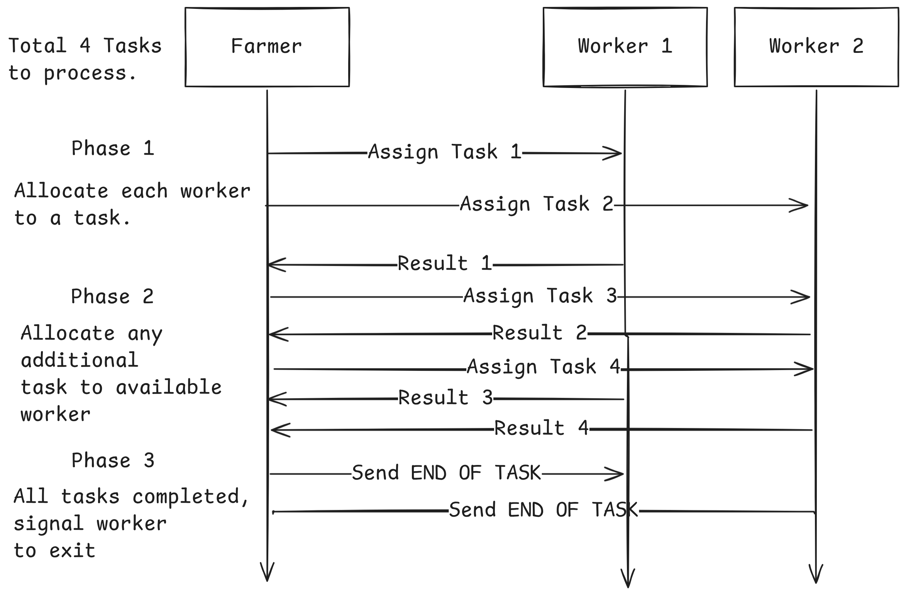

<h1 align="center">Parallel Programming Examples</h1>
<p align="center">
    
    
</p>

<p align="center">
  <a href="#description">Description</a> •
  <a href="#shared-memory">Shared Memory</a> •
  <a href="#message-passing">Message Passing</a>
</p>

# Description
This is a compilation of parallel programming examples which I have made and referenced with other sources.
Some of the concepts will have diagrams to explain the algorithm. The programs are divided based on their communication design: `shared memory` and `message passing interface(mpi)`.

# Shared Memory
- `counter/` - showcases race condition when multiple threads are incrementing a shared variable
- `hello-world/` - showcases race condition when passing a variable pointer to the thread argument.
- `producer-consumer/` - showcases race condition when reading data while another thread is writing to it.
- `jacobi/` - showcases the use of barriers to provide thread synchronization
- `prefix-sum/` - parallel prefix sum algorithm and the use of barriers for synchronizing between algorithm phases.

## How to use
```bash
# compiling c file
gcc <filename>.c -o test
# run c program
./test
```

# Message Passing
- `mpi-task-allocation/` - showcases message passing to divide bag of tasks among a fixed number of threads.
- `mpi-prime-sieve/` - showcases spawning of MPI child processes for finding prime numbers.

## How to use
```bash
# for mpi, install the required libary
sudo apt install build-essential
sudo apt install openmpi-bin libopenmpi-dev

# check binary
which mpic++

# set this to compiler path in .vscode/c_cpp_properties.json

# compile mpi code
mpic++ mpi.c -o mpi.exe
# run mpi program with 4 processes
mpirun -np 4 ./mpi.exe


# alternatively, build with cmake. (Eg. shown for prime-sieve)
# assume you created the CmakeLists.txt config
cd mpi-prime-sieve/build
make

mpirun -np 1 generator 10
```

## Task Allocation



## MPI Prime Sieve
Algorithm focuses on sending candidates from 2 - N to find prime numbers.

Everytime a candidate is not divisible by a prime number (eg. 5 not divisible by 2), it needs to be passed to the next sieve to check that it cannot be divisible by the next prime number. (eg. 5 should also not be divisible by 3).

Once all sieves are passed through (3 is the last sieve), then the last sieve will create a new sieve to store 5 as the prime number.
